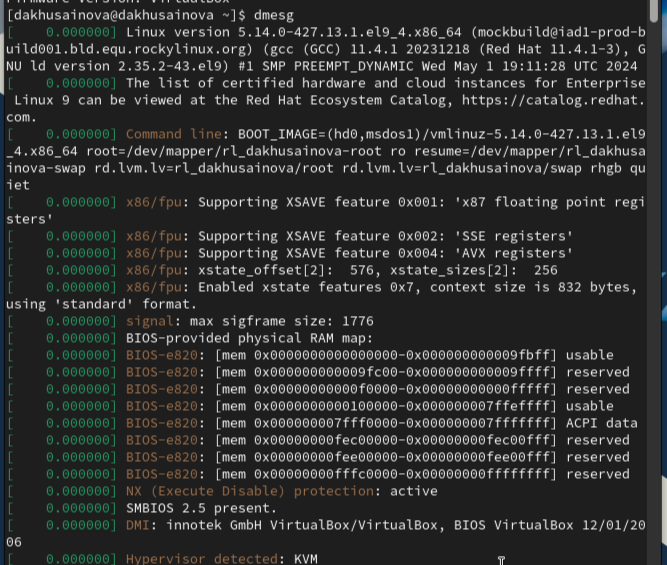

---
## Front matter
lang: ru-RU
title: "Лабораторная работа №1"
subtitle: "Установка и конфигурация операционной системы на виртуальную машину"
author: " Хусаинова Д.А. Группа НПИбд-02-21 "

## i18n babel
babel-lang: russian 
babel-otherlangs: english 
mainfont: Arial 
monofont: Courier New 
fontsize: 12pt

## Formatting pdf
toc: false
toc-title: Содержание
slide_level: 2
aspectratio: 169
section-titles: true
theme: metropolis
header-includes:
 - \metroset{progressbar=frametitle,sectionpage=progressbar,numbering=fraction}
 - '\makeatletter'
 - '\beamer@ignorenonframefalse'
 - '\makeatother'
---

# Цель работы

Установка ОС на Virtual Box для дальнейшего использования в ходе прохождения курса.

# Задание

1. Установить ОС на Virtual Box.
2. Получите следующую информацию.
   1. Версия ядра Linux (Linux version).
   2. Частота процессора (Detected Mhz processor).
   3. Модель процессора (CPU0).
   4. Объем доступной оперативной памяти (Memory available).
   5. Тип обнаруженного гипервизора (Hypervisor detected).
   6. Тип файловой системы корневого раздела.
   7. Последовательность монтирования файловых систем. [1]

# Теоретическое введение

Виртуальная машина (VM, от англ. virtual machine) — программная и/или аппаратная система, эмулирующая аппаратное обеспечение некоторой платформы (guest — гостевая платформа) и исполняющая программы для guest-платформы на host-платформе (host — хост-платформа, платформа-хозяин) или виртуализирующая некоторую платформу и создающая на ней среды, изолирующие друг от друга программы и даже операционные системы; также спецификация некоторой вычислительной среды. [2]

VirtualBox (Oracle VM VirtualBox) — программный продукт виртуализации для операционных систем Windows, Linux, FreeBSD, macOS, Solaris/OpenSolaris, ReactOS, DOS и других. [3]

# Выполнение лабораторной работы

# Установка ОС

Предварительно были скачаны Virtual Box (и установлена) и дистрибутив Rocky.

{ #fig:001 width=70% height=70% }

# Установка ОС. Объем памяти

{ #fig:002 width=70% height=70% }

# Установка ОС. Итоговая информация

{ #fig:003 width=70% height=70% }

# Запуск системы

{ #fig:004 width=70% height=70% }

# Сеть и имя узла

{ #fig:005 width=70% height=70% }

# Место установки оставляем неизменным  

{ #fig:006 width=70% height=70% }

# Отключение KDUMP 

{ #fig:007 width=70% height=70% }

# Установка пароля для root, создание пользователя 

{ #fig:008 width=70% height=70% }

# Процесс установки 

{ #fig:009 width=70% height=70% }

# Переход в ОС Linux

{ #fig:010 width=70% height=70% }

# Проверка корректности имени хоста 

{ #fig:011 width=70% height=70% }

# Домашнее задание. Часть 1

{ #fig:012 width=70% height=70% }

# Домашнее задание. Часть 2

{ #fig:013 width=70% height=70% }

# Домашнее задание. Часть 3

{ #fig:014 width=70% height=70% }

# Домашнее задание. Часть 4

{ #fig:015 width=70% height=70% }

# Вывод

В ходе выполнения лабораторной работы была установлена новая ОС на новую виртуальную машину. Так была найдена следующая информация:

- версия ядра Linux 5.14.0-427.13.1.el9_4.x86_64
- частота процессора 2166.666 МГц
- модель процессора Intel(R) Celeron(R) N2830 @ 2.16Ghz
- обьем доступной оперативной памяти 260860К/20966969К
- тип обнаруженного гипервизора KVM
- тип файловой системы корневого раздела xfs
- последовательность монтирования файловых систем

# Библиография

1. Методические материалы курса.
2. Wikipedia: Виртуальная машина. (https://ru.wikipedia.org/wiki/%D0%92%D0%B8%D1%80%D1%82%D1%83%D0%B0%D0%BB%D1%8C%D0%BD%D0%B0%D1%8F_%D0%BC%D0%B0%D1%88%D0%B8%D0%BD%D0%B0)
3. Wikipedia: Virtual Box. (https://ru.wikipedia.org/wiki/VirtualBox)
