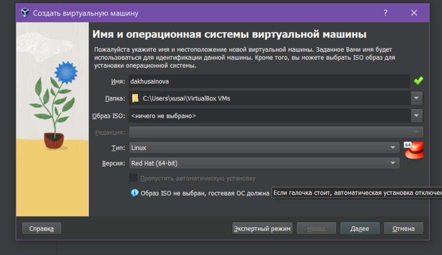
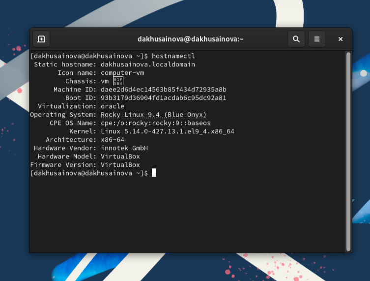

---
## Front matter
title: "Отчёт по лабораторной работе №1

Информационная безопасность"
subtitle: "Настройка рабочего пространства и конфигурация операционной системы на виртуальную машину."
author: "Хусаинова Динара Айратовна, 

НПИбд-02-21, 1032212283"

babel-lang: russian 
babel-otherlangs: english 
mainfont: Arial 
monofont: Courier New 
fontsize: 12pt

## Generic otions
lang: ru-RU
toc-title: "Содержание"

## Bibliography
bibliography: bib/cite.bib
csl: pandoc/csl/gost-r-7-0-5-2008-numeric.csl

## Pdf output format
toc: true # Table of contents
toc-depth: 2
lof: true # List of figures
fontsize: 12pt
linestretch: 1.5
papersize: a4
documentclass: scrreprt
## I18n polyglossia
polyglossia-lang:
  name: russian
  options:
	- spelling=modern
	- babelshorthands=true
polyglossia-otherlangs:
  name: english
## I18n babel
babel-lang: russian
babel-otherlangs: english
## Fonts
mainfont: PT Serif
romanfont: PT Serif
sansfont: PT Sans
monofont: PT Mono
mainfontoptions: Ligatures=TeX
romanfontoptions: Ligatures=TeX
sansfontoptions: Ligatures=TeX,Scale=MatchLowercase
monofontoptions: Scale=MatchLowercase,Scale=0.9
## Biblatex
biblatex: true
biblio-style: "gost-numeric"
biblatexoptions:
  - parentracker=true
  - backend=biber
  - hyperref=auto
  - language=auto
  - autolang=other*
  - citestyle=gost-numeric
## Pandoc-crossref LaTeX customization
figureTitle: "Рис."
tableTitle: "Таблица"
listingTitle: "Листинг"
lofTitle: "Список иллюстраций"
lolTitle: "Листинги"
## Misc options
indent: true
header-includes:
  - \usepackage{indentfirst}
  - \usepackage{float} # keep figures where there are in the text
  - \floatplacement{figure}{H} # keep figures where there are in the text
---

# Цель работы

Настроить рабочее пространство для лабораторных работ, приобрести практические навыки установки операционной системы на виртуальную машину и настройки минимально необходимых для дальнейшей работы сервисов.

# Теоретическое введение

**Oracle VM VirtualBox** — это мощная и бесплатная виртуализационная платформа, разработанная корпорацией Oracle, которая позволяет пользователям создавать и управлять виртуальными машинами на своих компьютерах. [1]

# Выполнение лабораторной работы

## Установка и конфигурация операционной системы на виртуальную машину

### Virtual Box

{ #fig:001 width=70% height=70% }

{ #fig:002 width=70% height=70% }

{ #fig:003 width=70% height=70% }

{ #fig:004 width=70% height=70% }

{ #fig:005 width=70% height=70% }

{ #fig:006 width=70% height=70% }

{ #fig:007 width=70% height=70% }

{ #fig:008 width=70% height=70% }

{ #fig:009 width=70% height=70% }

### Переход в ОС Linux

{ #fig:010 width=70% height=70% }

{ #fig:011 width=70% height=70% }

### Домашнее задание

{ #fig:012 width=70% height=70% }

{ #fig:013 width=70% height=70% }

{ #fig:014 width=70% height=70% }

{ #fig:015 width=70% height=70% }

# Вывод

Были настроено рабочее пространство для лабораторных работ, приобретены практические навыки
установки операционной системы на виртуальную машину и настройки минимально необходимых для дальнейшей работы сервисов.

# Список литературы. Библиография

[1] Документация по Virtual Box: https://www.virtualbox.org/wiki/Documentation
