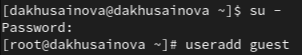
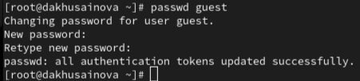
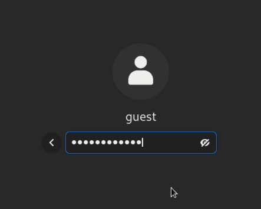
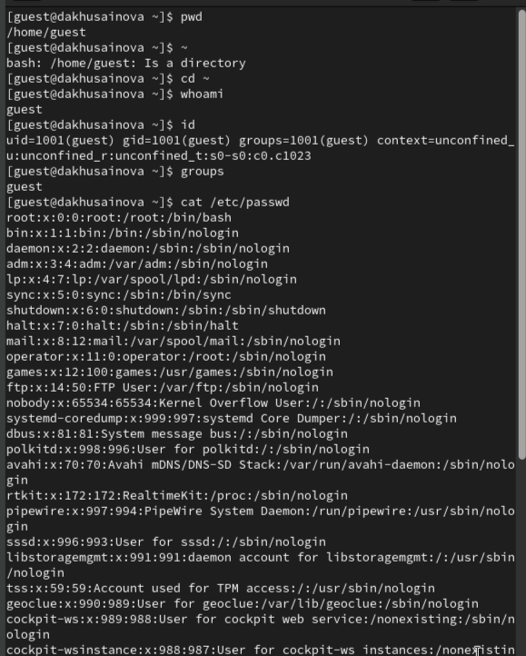
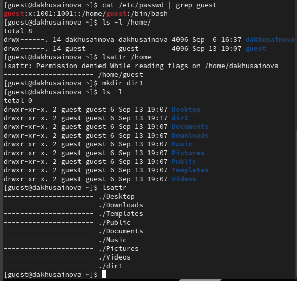
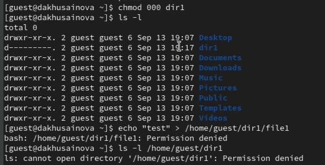

---
## Front matter
lang: ru-RU
title: "Лабораторная работа №2"
subtitle: "Дискреционное разграничение прав в Linux. Основные атрибуты"
author: " Хусаинова Д.А. Группа НПИбд-02-21 "

## i18n babel
babel-lang: russian 
babel-otherlangs: english 
mainfont: Arial 
monofont: Courier New 
fontsize: 12pt

## Formatting pdf
toc: false
toc-title: Содержание
slide_level: 2
aspectratio: 169
section-titles: true
theme: metropolis
header-includes:
 - \metroset{progressbar=frametitle,sectionpage=progressbar,numbering=fraction}
 - '\makeatletter'
 - '\beamer@ignorenonframefalse'
 - '\makeatother'
---

# Цель работы

Получить практические навыки работы в консоли с атрибутами файлов, закрепить теоретические основы дискреционного разграничения доступа в современных системах с открытым кодом на базе ОС Linux

# Теоретическое введение

**Операционная система** — то комплекс программ, предназначенных для управления ресурсами компьютера и организации взаимодействия с пользователем [1].

**Права доступа** определяют, какие действия конкретный пользователь может или не может совершать с определенным файлами и каталогами. С помощью разрешений можно создать надежную среду — такую, в которой никто не может поменять содержимое ваших документов или повредить системные файлы. [2].

# Выполнение лабораторной работы

# Атрибуты файлов 1

В установленной при выполнении предыдущей лабораторной работы операционной системе создадим учётную запись пользователя guest (использую учётную запись администратора):
useradd guest
Зададим пароль для пользователя guest (используя учётную запись администратора):
passwd guest

# Атрибуты файлов 2

{ #fig:001 width=70% height=70% }

# Атрибуты файлов 3 

{ #fig:002 width=70% height=70% }

# Вход в систему от имени пользователя guest. 

{ #fig:003 width=70% height=70% }

# Команды whoami, id, cat /etc/passwd

{ #fig:004 width=70% height=70% }

# Команды lsattr /home, mkdir dir1, chmod 000 dir1, ls -l

{ #fig:005 width=70% height=70% }

# Попытка создать файл 

Попытайтесь создать в директории dir1 файл file1 командой
echo "test" > /home/guest/dir1/file1
Проверим командой, ls -l /home/guest/dir1 что действительно файл file1 не находится внутри директории dir1.

{ #fig:006 width=70% height=70% }

# Вывод

Были получены практические навыки работы в консоли с атрибутами файлов, закреплены теоретические основы дискреционного разграничения доступа в современных системах с открытым кодом на базе ОС Linux.

# Список литературы. Библиография

[1] Операционные системы: https://blog.skillfactory.ru/glossary/operaczionnaya-sistema/

[2] Права доступа: https://codechick.io/tutorials/unix-linux/unix-linux-permissions
