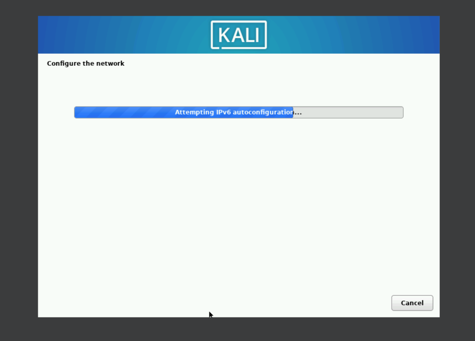

---
## Front matter
lang: ru-RU
title: "Этап №1 индивидуального проекта"
subtitle: "Установка Kali Linux"
author: " Хусаинова Д.А. Группа НПИбд-02-21 "

## i18n babel
babel-lang: russian 
babel-otherlangs: english 
mainfont: Arial 
monofont: Courier New 
fontsize: 12pt

## Formatting pdf
toc: false
toc-title: Содержание
slide_level: 2
aspectratio: 169
section-titles: true
theme: metropolis
header-includes:
 - \metroset{progressbar=frametitle,sectionpage=progressbar,numbering=fraction}
 - '\makeatletter'
 - '\beamer@ignorenonframefalse'
 - '\makeatother'
---

# Цель работы

Установить Kali Linux.

# Задание

1. Установить Kali Linux.

# Теоретическое введение

Kali Linux - это дистрибутив Linux на базе Debian с открытым исходным кодом, предназначенный для решения различных задач информационной безопасности, таких как тестирование на проникновение, исследования в области безопасности, компьютерная экспертиза и обратный инжиниринг[1].

# Выполнение этапа 

# Установка Kali Linux

{ #fig:001 width=70% height=70% }

# Выбор образа

{ #fig:002 width=70% height=70% }

# Созданная и настроенная витуальная машина

{ #fig:111 width=70% height=70% }

# Процесс установки

{ #fig:003 width=70% height=70% }

# Имя пользователя и задание пароля

{ #fig:004 width=70% height=70% }

# Вход в систему

{ #fig:005 width=70% height=70% }

# Интерфейс Kali Linux

{ #fig:006 width=70% height=70% }

# Вывод

В ходе выполнения первого этапа проекта успешно установлен Kali Linux.

# Библиография

1. Документация по Kali Linux: https://www.kali.org/