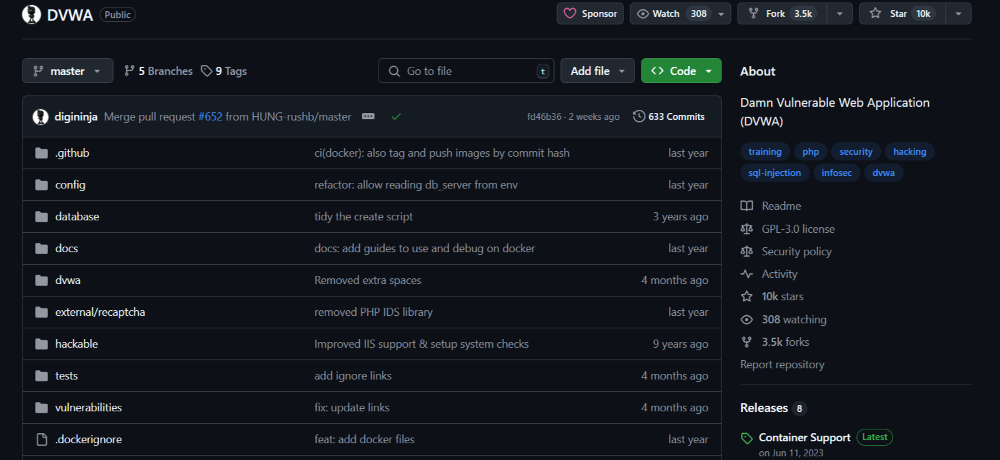
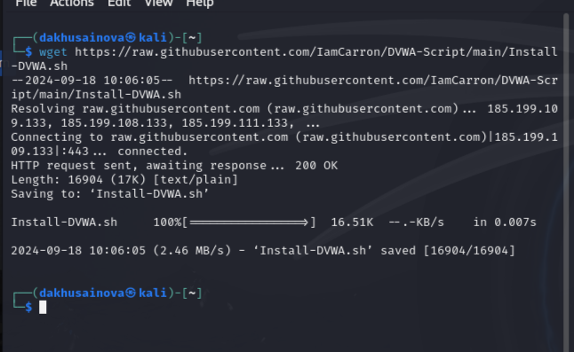
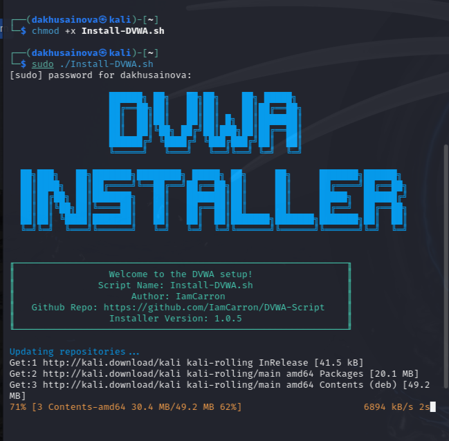
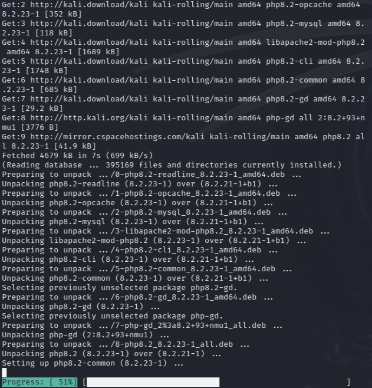
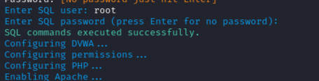
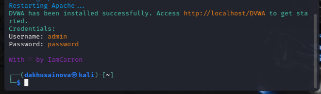

---
## Front matter
lang: ru-RU
title: "Этап №2 индивидуального проекта"
subtitle: "Установка DVWA"
author: " Хусаинова Д.А. Группа НПИбд-02-21 "

## i18n babel
babel-lang: russian 
babel-otherlangs: english 
mainfont: Arial 
monofont: Courier New 
fontsize: 12pt

## Formatting pdf
toc: false
toc-title: Содержание
slide_level: 2
aspectratio: 169
section-titles: true
theme: metropolis
header-includes:
 - \metroset{progressbar=frametitle,sectionpage=progressbar,numbering=fraction}
 - '\makeatletter'
 - '\beamer@ignorenonframefalse'
 - '\makeatother'
---

# Цель работы

Установить DVWA.

# Задание

1. Установить DVWA.

# Теоретическое введение

Damn Vulnerable Web Application (DVWA) — это веб-приложение на PHP/MySQL, которое содержит различные уязвимости [1].

# Выполнение этапа 

# Репозиторий для скачивания

{ #fig:006 width=70% height=70% }

# Выполнение команды wget

{ #fig:001 width=70% height=70% }

# Исполняемый скрипт. Запуск скрипта

{ #fig:002 width=70% height=70% }

# Загрузка 

{ #fig:003 width=70% height=70% }

# SQL пользователь

{ #fig:004 width=70% height=70% }

# Загрузка прошла успешно

{ #fig:005 width=70% height=70% }

# Вывод

В ходе выполнения первого этапа проекта успешно установлен DVWA.

# Библиография

1. Документация по DVWA: https://kali.tools/?p=1820